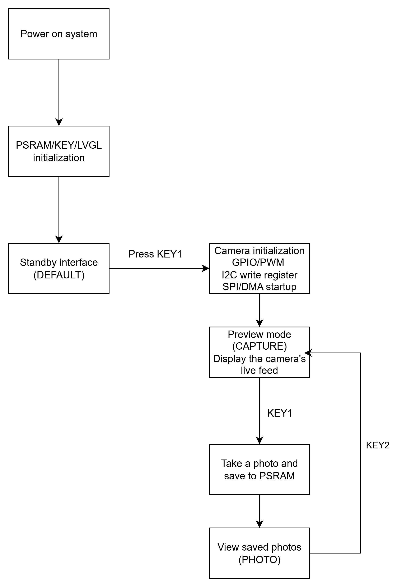

# BF30A2 SPI Camera Driver

Source code path: example\rt_device\camera\BF30A2

## Supported Platforms
* sf32lb52-lcd_n16r8

## Overview
* Demonstrates the driver capability for the BF30A2 camera, implementing basic photo capture functionality
* This example uses the camera device. When using the RT-Thread operating system, the camera peripheral is virtualized as an rt_device for data read operations. Ensure the following three options are correctly enabled in menuconfig:
```c
CONFIG_BSP_USING_SPI2=y
CONFIG_BSP_SPI2_RX_USING_DMA=y
CONFIG_BSP_USING_SPI_CAMERA=y
```

* Navigate to the project directory of the example and run the scons command to compile the code:
```
scons --board=sf32lb52-lcd_n16r8 -j8
```
* Navigate to the `project/build_xx` directory of the example, run `uart_download.bat`, and select the port as prompted to download:

>`build_sf32lb52-lcd_n16r8_hcpu\uart_download.bat` // Download code

>`Uart Download`

>`please input the serial port num:5`

For detailed steps on compiling and downloading, please refer to the relevant introduction in [](/quickstart/get-started.md).

### Hardware Connection
```{eval-rst}
+--------------+----------+---------------+---------------+
| Dev Board    | Function | Local Pin     | Remote Pin    
+==============+==========+===============+===============+
| sf32lb52-lcd | PA_37    | dio           | SPI_D0        |
+              +----------+---------------+---------------+
|              | PA_39    | clk           | SPI_CLK       |
+              +----------+---------------+---------------+
|              | PA_40    | cs            | GND           |
+              +----------+---------------+---------------+
|              | PA_29    | cs            | MCLK          |
+              +----------+---------------+---------------+
|              | PA_43    | cs            | PWDN          |
+              +----------+---------------+---------------+
|              | PA_42    | cs            | IIC_SDA       |
+              +----------+---------------+---------------+
|              | PA_41    | cs            | IIC_SCL       |
+--------------+----------+---------------+---------------+
```
---

## 2. Implementation Details

### 2.1 Hardware Interface

```
┌─────────────┐         ┌──────────────┐
│  SF32LB52   │         │   BF30A2     │
│             │         │              │
│  I2C ───────┼────────►│ SCCB (Config)│
│  PWM ───────┼────────►│ MCLK (Clock) │
│  GPIO ──────┼────────►│ PWDN (Ctrl)  │
│             │         │              │
│  SPI2 ◄─────┼─────────│ SPI (Data)   │
│  (Slave)    │         │ (Master)     │
└─────────────┘         └──────────────┘
```

- **I2C**: Writes register table from `bf30a2_spi_config.h` to complete sensor initialization
- **PWM**: Configured for 24MHz output as camera master clock
- **SPI**: Slave mode, 3-wire interface, DMA circular reception for image data

### 2.2 Data Parsing

The SPI data stream uses MTK-tagged protocol format. The driver uses a state machine to parse data byte-by-byte, extracts YUV data for each line, and converts it to RGB565.

### 2.3 Memory Allocation

| Buffer | Size | Purpose |
|--------|------|---------|
| DMA Buffer | ~8KB | SPI circular reception |
| RGB565 Frame | 150KB | Current frame storage (240×320×2) |
| PSRAM Heap | 512KB | Photo storage |

---

## 3. Workflow



**Data Acquisition Thread:**
1. DMA interrupt triggers event notification
2. Read new data from ring buffer
3. State machine parses protocol
4. YUV to RGB565 conversion for each line
5. Trigger callback on frame completion, update UI

---

## 4. Usage Guide

### 4.1 API Interface

```c
// Initialize/Deinitialize
rt_err_t bf30a2_init(void);
void bf30a2_deinit(void);

// Start/Stop capture
rt_err_t bf30a2_start(void);
void bf30a2_stop(void);

// Set frame completion callback
void bf30a2_set_callback(
    void (*cb)(uint32_t num, uint8_t *yuv, uint8_t *rgb565, void *ctx), 
    void *ctx
);

// Get status
uint8_t bf30a2_is_running(void);
uint32_t bf30a2_get_frames(void);
float bf30a2_get_fps(void);

// Get current frame data
int bf30a2_get_rgb565(uint8_t *buf, uint32_t size);
```


### 4.3 Shell Command Reference
Note: The following operation commands can be used for debugging when there is no screen or buttons. When a screen and buttons are available, using these commands may cause conflicts.

#### 4.3.1 Camera Control Commands

**`cmd_cam_init`** - Initialize camera driver
```c
msh >cmd_cam_init
[I/bf30a2] BF30A2 init OK
[I/bf30a2]   DMA buffer: 8448 bytes
[I/bf30a2]   RGB565 buffer: 153600 bytes
[I/bf30a2]   Total: 158 KB
```

**`cmd_cam_start`** - Start capture
```c
msh >cmd_cam_start
[I/bf30a2] Capture started
```

**`cmd_cam_stop`** - Stop capture
```c
msh >cmd_cam_stop
[I/bf30a2] Stopped: 127 complete frames, 0 errors
```

**`cmd_cam_status`** - View camera runtime status
```c
msh >cmd_cam_status
[I/bf30a2] === BF30A2 Status ===
[I/bf30a2] Running: 1
[I/bf30a2] Frames: 256 complete
[I/bf30a2] Lines: 81920, Errors: 0
[I/bf30a2] FPS: 15.0
[I/bf30a2] =====================
```
- **Running**: 1=running, 0=stopped
- **Frames**: Number of complete frames successfully received
- **Lines**: Cumulative number of lines received
- **Errors**: Number of parsing errors (line number out of bounds, sync loss, etc.)
- **FPS**: Real-time frame rate

---

#### 4.3.2 Application Status Commands

**`app_status`** - View overall application status
```c
msh >app_status
[I/main] === Application Status ===
[I/main] App state: CAPTURE
[I/main] Camera HW init: 1
[I/main] Camera running: 1
[I/main] RGB565 buffer: 0x20039DF4
[I/main] PSRAM photo valid: 1
[I/main] FPS: 15.0
[I/main] Frames: 312
[I/main] ==========================
```
- **App state**: `DEFAULT` (standby) / `CAPTURE` (preview) / `PHOTO` (view photo)
- **Camera HW init**: Whether hardware is initialized
- **Camera running**: Whether capture thread is running
- **RGB565 buffer**: Current frame buffer address
- **PSRAM photo valid**: Whether there is a valid photo in PSRAM

---

#### 4.3.3 PSRAM Storage Commands

**`psram_heap_status`** - View PSRAM heap memory status
```c
msh >psram_heap_status
[I/main] === PSRAM Heap Status ===
[I/main]   Initialized: Yes
[I/main]   Total: 524288 bytes (512 KB)
[I/main]   Used: 153600 bytes (150 KB)
[I/main]   Free: 370688 bytes (362 KB)
[I/main]   Photo valid: Yes
[I/main] =========================
```

**`psram_photo_info`** - View detailed information of saved photo
```c
msh >psram_photo_info
[I/main] === PSRAM Photo Info ===
[I/main]   Valid: Yes
[I/main]   Size: 240x320
[I/main]   Data size: 153600 bytes
[I/main]   Address: 0x20080000
[I/main]   Timestamp: 125000 ticks
[I/main] ========================
```
Output when no photo exists:
```c
msh >psram_photo_info
[I/main] No photo in PSRAM
```

**`psram_photo_clear`** - Clear photo from PSRAM
```c
msh >psram_photo_clear
[I/main] PSRAM photo cleared
```

---

#### 4.3.4 Photo Export Commands

**`psram_export`** - Export photo via UART (hexadecimal format)
```c
msh >psram_export
[I/main] ========================================
[I/main] Exporting photo from PSRAM via UART...
[I/main] Format: RGB565, Size: 240x320
[I/main] Total bytes: 153600
[I/main] PSRAM addr: 0x20080000
[I/main] ========================================

===PHOTO_START===
WIDTH:240
HEIGHT:320
FORMAT:RGB565
SIZE:153600
SOURCE:PSRAM
===DATA_BEGIN===
00001F001F001F001F001F001F001F00...
1F001F001F001F001F001F001F001F00...
... (64 hexadecimal characters per line, 4800 lines total)
===DATA_END===
===PHOTO_END===

[I/main] Photo export completed!
```
Output when no photo exists:
```c
msh >psram_export
[W/main] No valid photo in PSRAM
```

**Data Format Description:**
- Every 2 bytes represent 1 RGB565 pixel (little-endian)
- Each line outputs 32 bytes (64 hexadecimal characters)
- Total 153,600 bytes = 4,800 lines
- Can be parsed and converted to image using Python script

### 4.4 Button Operations

| State | KEY1 | KEY2 |
|-------|------|------|
| Standby | Enter preview | - |
| Preview | Take photo | Return to standby |
| Photo | - | Return to preview |

---

## 5. Technical Specifications

| Parameter | Value |
|-----------|-------|
| Image Resolution | 240 × 320 |
| Output Format | RGB565 |
| SPI Clock | 24MHz |
| Frame Rate | 6~15 FPS |
| Single Frame Size | 153,600 bytes |